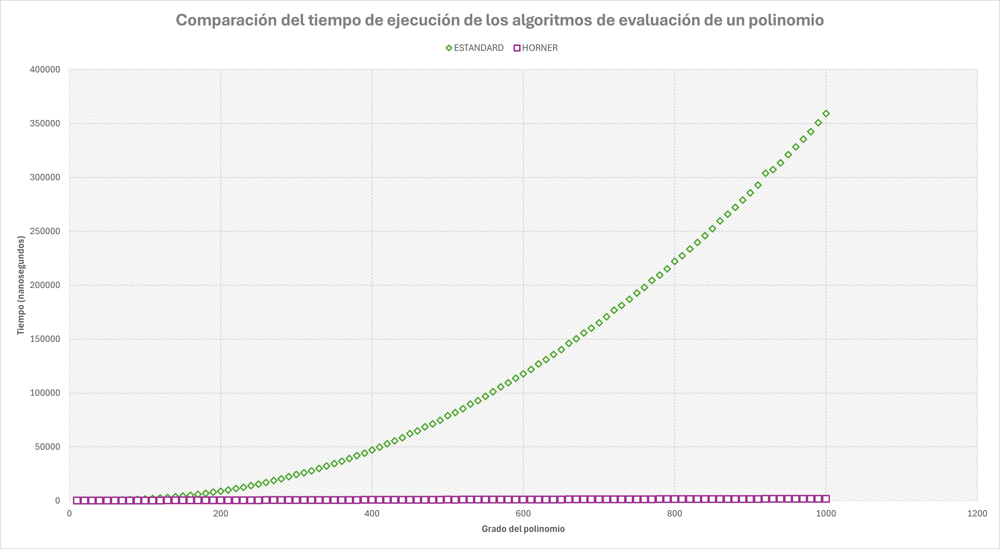

# ComparacionAlgoritmosPolinomio
Este es un programa que compara dos algoritmos para evaluar un polinomio. Los algoritmos a comparar son la evaluación estándar y la evaluación por regla de Horner.

1. Método de evaluación de un polinomio estándard
   - Sea un polinomio del tipo a[0]x<sup>(grado)</sup> + a[1]x<sup>(grado-1)</sup> + ... + a[n]. Evalúa un polinomio por el método estándar. El algoritmo calcula el valor del polinomio ( f(x) ) realizando una sumatoria del calculo de término, comenzando por el último a[n].

2. Método de evaluación por regla de Horner
   - Sea un polinomio del tipo a[0]x<sup>(grado)</sup> + a[1]x<sup>(grado-1)</sup> + ... + a[n]. El algoritmo calcula el valor del polinomio ( f(x) ), se le asigna el valor del polinomio inicial con el primer término a[0], el valor actual se multiplica por x y se le suma el coeficiente siguiente más bajo del polinomio hasta llegar al final del polinomio.

## Estructura del repositorio
* Datos: Aquí se encuentran los archivos .csv crudros de los tiempos de ejecucción de cada uno de los algoritmos e imágenes de las gráficas.
* Documentation/html: Contiene los archivos necesarios para abrir la documentación de Doxygen.
* Doxygen: Archivo de formato para Doxygen.
* **<ins>Documentacion.lnk : Documentación del código fuente.</ins>**

## Archivos de código
* AlgoritmosEval.hpp : Prototipos de las funciones de evaluación del polinomio.
* FuncionesAuxiliares.hpp: Prototipos de las funciones auxiliares.
* main.cpp : Código fuente principal.
* AlgoritmosEval.cpp : Definiciones de los algoritmos de evaluación del polinomio.
* FuncionesAuxiliares.cpp: Definiciones de las funciones auxiliares.
  
## Requisitos del sistema
* C++ 20
* Compilador g++
* Visual Studio 2022 (para Windows)

> [!WARNING]
> El programa fué escrito en una computadora con sistema operativo Windows 11, es posible que algunas instrucciones arrojen una advertencia en Linux.

## Instrucciones de compilación
### Linux
1. Clone el repositorio:
```
git clone https://github.com/Cydraa/ComparacionAlgoritmosPolinomio.git
cd ComparacionAlgoritmosPolinomio/ComparacionEvaluacionPolinomios/
```
2. Compile el código
```
g++ -o evaluacion main.cpp AlgoritmosEval.cpp FuncionesAuxiliares.cpp -std=c++20
```

3. Ejecute el programa
```
./evaluacion
```

### Windows
1. Clone el repositorio:
```
git clone https://github.com/Cydraa/ComparacionAlgoritmosPolinomio.git
cd ComparacionAlgoritmosPolinomio/ComparacionEvaluacionPolinomios/
```
2. En la carpeta ComparacionAlgoritmosPolinomio/ComparacionEvaluacionPolinomios/, abrir el archivo ComparacionEvaluacionPolinomios.sln usando Visual Studio 2022.
3. Compile el código: haciendo click derecho sobre la solución en el explorador de la solución (Build Solution...) o pulsando CTRL+SHIFT+B.
5. Ejecute el programa: Pulse CTRL+F5 o haga click en "Start without debugging" en la parte superior del IDE.

## Diseño del experimento
Se utilizaron valores de grado del polinomio creciente, desde 10 a 1000, con incrementos de 10. En cada grado, se creó un polinomio de ese grado y se evaluó en un valor de x aleatorio por dos métodos distintos: el método estándar y el método por regla de Horner. Se realizaron 1000 repeticiones por cada evaluación y se obtuvo el promedio de cada uno de ellos.

## Resultados del análisis y conclusión
El programa se ejecutó de manera exitosa en Windows 11. Como se puede observar en la gráfica inferior, el algoritmo que utiliza el método estándard para evaluar un polinomio requiere más tiempo de ejecucción al aumentar el grado. Por la naturaleza de los resultados, y, al realizar el análisis del algoritmo, se puede concluir que el algoritmo tiene una complejidad de tiempo O(n<sup>2</sup>),Ω(<sup>2</sup>), 𝚯(<sup>2</sup>).

Por otro lado, el algoritmo que utiliza el metodo de Horner el tiempo de ejecución al aumentar el grado es casi indistinguible en la gráfica. Esto se debe a que el tiempo de ejecución de este algoritmo se incrementa muy poco al aumentar el grado del polinomio. Al realizar el análisis de este algoritmo, se puede concluir que el algoritmo con la regla de Horner tiene una complejidad de tiempo O(n), Ω(n), 𝚯(n).

 %20Core(TM)%20i7%2011700F-purple)

